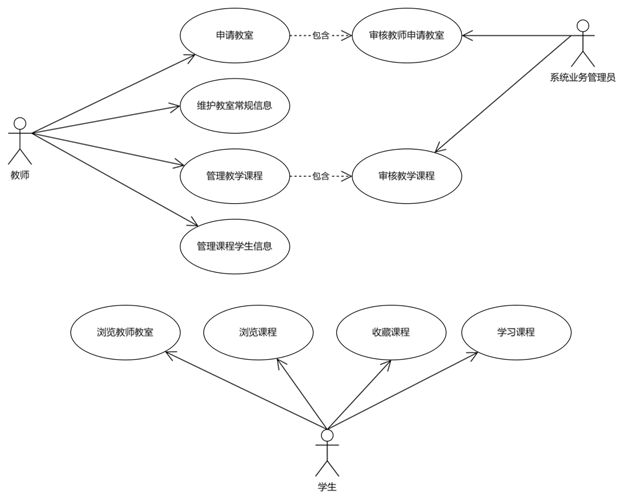

## 业务内容说明
《亮点在线课堂管理信息系统》是一个供教师和学生实施组织联机教学的软件，被授权的教师可以在本系统中创建个人教室、编辑管理课程、课程节次、学习内容、考核等，课程限于发布到个人教室，课程的形式包括随时浏览的静态内容课程、指定时间播讲的联机课程两类，教师用户可以限制所发布的课程供游客、注册学生、指定学生等范围使用；学生用户可以浏览教师教室，根据自己所需，进入教室进行学习、参加考核，也可以根据自身的学习需求，定制学习的课程、关注喜欢的课程、申请参加定时播讲的课程等，系统总体的业务内容如下图所示：

#### 系统用户需求概要
|序号|用户（类型）|需求说明|
|:------|:------|:--------|
|1|学生| 希望 通过系统 <b>查询</b> 教师开办的 <b>教室</b>，以便了解是否有合适自己的课程；  希望 通过系统 <b>查询</b> 所有的课程， 以便了解是否有合适自己的课程；  .......