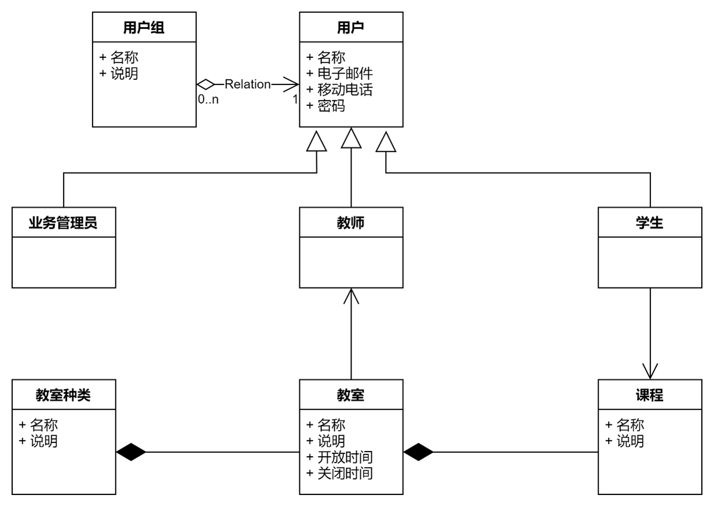

## 业务数据分析定义说明

[toc]

本课题的业务数据分为普通业务数据、专门业务数据两类进行说明。

### 1. 系统普通数据

|序号|数据名称|数据项简述|教师|学生|业务管理员|系统|
|:-----|:-----|:------|:-------|:------|:-------|:-----|
|1|用户|独立的记录系统使用者的身份的数据，在应用中代表凭证。|申请|申请|审核、管理|校验、存储|

### 2. 系统业务数据

|序号|数据名称|数据项简述|教师|学生|业务管理员|系统|
|:-----|:-----|:------|:-------|:------|:-------|:-----|
|1|教室种类|用于限制教师个人教室范围的一个规格性的数据，支持子引用的层次类型使用。|查询|查询|管理|校验、存储|

### 3. 数据关系图

